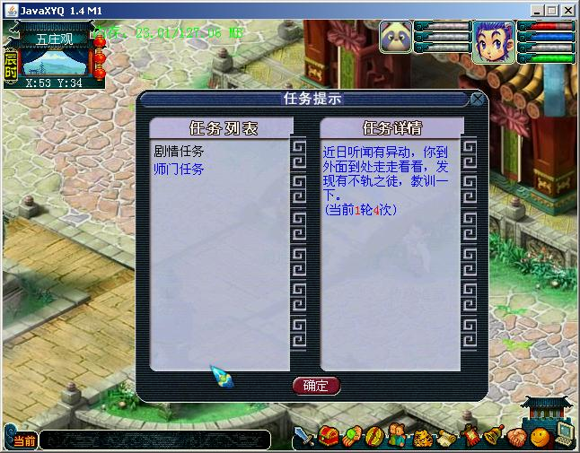

Java XYQ
=======

Pure Java based 2D turn-based RPG

Java XYQ 是使用纯 Java 实现的一个 2D 回合制 RPG 游戏，大部分资源来自《梦幻西游》，类似梦幻西游玩法、风格。

## Change logs

### 2020/05/02

- fork from origin repo: https://github.com/kylixs/javaxyq;
- convert file encoding from gbk to utf8;
- leverage gradle to manage dependencies and build;
- change project structure to maven style;
- leverage lombok use simplify Java code;
- migrate log from `stdout` and `stderr` to `slf4j` and `logback`;
- migrate database from derby to `sqlite3`;
- migrate jpeg process from `sun` to `image io`;
- build agianst Java 8;

Notes: 

The migration work is partially done, only tested on macOS 10.15 with Java 8.

It seems that `com.javaxyq.core.DesktopApplication` almostly works fine, other runnable classes which has `main` method has not been tested.

## Below is origin content, fixed images links and formats

another site: http://javaxyq.googlecode.com link seems broken (2020/05/02)

纯Java实现的《梦幻西游》风格的回合制RPG游戏

JavaXYQ项目已经迁移到github，请移步至：

- Java版本：https://github.com/kylixs/javaxyq

- Android版本：https://github.com/kylixs/xyqlite

### 项目目标

打造成一款强大方便的RPG游戏引擎，提供场景编辑器、任务编辑器、扩展脚本、UI编辑器等，期望可以达到或超过RPG Maker的功能。
灵活可扩展的2D回合制游戏引擎，将来不局限于梦幻西游、大话西游的资源。
欢迎感兴趣的朋友申请加入项目，主要工作有游戏策划、游戏分析、代码编写、美术设计、开源项目维护（文档、缺陷）等。如要申请加入，请在Wiki的 JoinJavaXYQ 页面留下你的google账号。

最新演示视频：http://v.youku.com/v_show/id_XMTM1Njk1ODA0.html 

在线运行JavaXYQ：http://javaxyq.appspot.com/ (更新时间：2010.3.6) link seems broken (2020/05/02)

### 预览图

### 视频

- JavaXYQ导游 http://v.youku.com/v_playlist/f3936559o1p2.html

- 更多请点击查看相关视频 http://www.youku.com/playlist_show/id_3936559.htm
